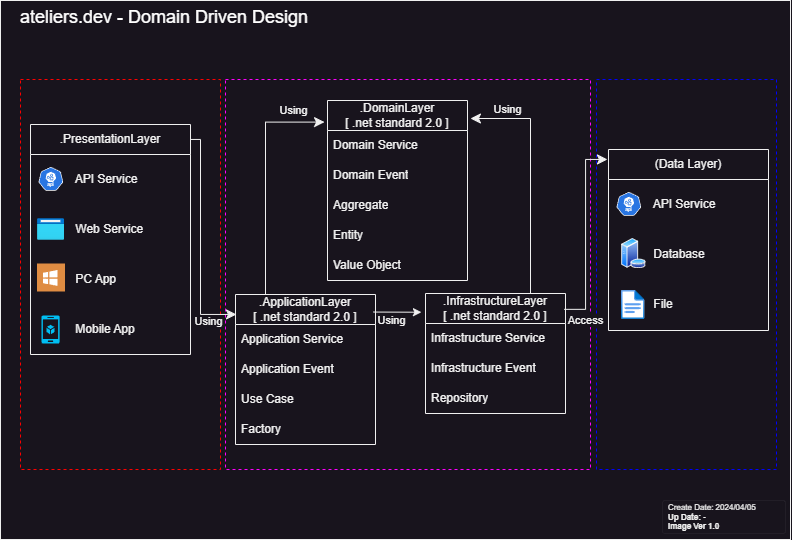

## 1. ライセンス

このプロジェクトは [MIT ライセンス](LICENSE) の下で提供されています。  
詳細については、[LICENSE](LICENSE) ファイルをご覧ください。  
  
(This project is licensed under the terms of the [MIT License](LICENSE). See the [LICENSE](LICENSE) file for details. )

## 2. リポジトリについて

C# による汎用機能ライブラリです。  
ateliers.dev のプロジェクト全てに適用する中核です。

## 3. 動作確認環境（開発環境）

以下の環境で開発作業をしています。

```
【2024/04/05】
OS: Windows 11

IDE: Visual Studio Community 2022 - Version 17.10.0 
+ GitHub Copilot - 1.156.0.0

IDE: Visual Studio Code - Version 1.87.2
+ GitHub Copilot - 1.175.0
```

## 4. 設計手法

ドメイン駆動設計 (DDD) を元に C# で製造しています。  
基本的な設計はMicrosoft社のガイドラインを元にしています。  
https://learn.microsoft.com/ja-jp/dotnet/architecture/microservices/microservice-ddd-cqrs-patterns/ddd-oriented-microservice

## 5. プロジェクト構成

### 5.1. メインプロジェクト

DDDの概念に基づき、以下の3つから構成されます。  
ライブラリであるため プレゼンテーションレイヤーは存在しません。

#### 概要図



---

#### Ateliers.Core.ApplicationLayer プロジェクト:  
`.Net Standard 2.0` (2024/04/01 時点)  

*【実装項目】*
- アプリケーションサービス
- アプリケーションイベント
- ユースケース
- ファクトリ
  
*【参照依存】*
- DomainLayer
- InfrastructureLayer

---

#### Ateliers.Core.DomainLayer プロジェクト:  
`.Net Standard 2.0` (2024/04/01 時点)    

*【実装項目】*
- ドメインサービス
- ドメインイベント
- 集約
- エンティティ
- 値オブジェクト

---

#### Ateliers.Core.InfrastructureLayer プロジェクト:  
`.Net Standard 2.0` (2024/04/01 時点)    

*【実装項目】*
- インフラストラクチャサービス
- インフラストラクチャイベント
- リポジトリ

*【参照依存】*
- DomainLayer

---

### 5.2. サブプロジェクト

DDDには関連しないサポートプロジェクトです。  
生成AIの指示やテストサポートなどを提供します。

---

#### AAteliers.Core.TestHelper プロジェクト:  
`.Net Standard 2.0` (2024/04/01 時点)    

テスト製造に使用する関数を格納したプロジェクトです。  
単体テスト作成のサポート機能を提供します。

---

## 6. サブモジュール化の手順

### 1. コマンド

現在のプロジェクトディレクトリに submodules というディレクトリを作成して、その中に Ateliers.Core サブモジュールを追加したい場合：
```
git submodule add https://github.com/yuu-git/Ateliers.Core.git submodules/Ateliers.Core
```

### 2. サブモジュールのブランチについて

基本的に master の使用を推奨。  
開発中機能の使用は Develop ブランチを使用し、試験的機能を試す場合は、新しくブランチを作る。  
`checkout` および `pull` の手順は以下の通り  
```
サブモジュールディレクトリに移動後：
git checkout master
git pull origin master
```
または
```
サブモジュールディレクトリに移動後：
git checkout Develop
git pull origin Develop
```
